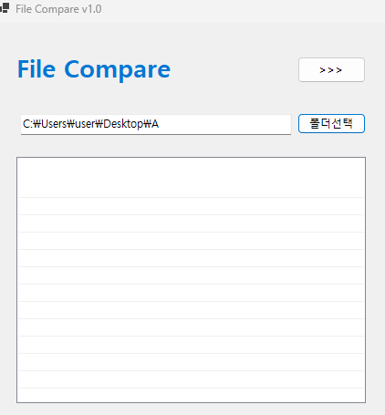
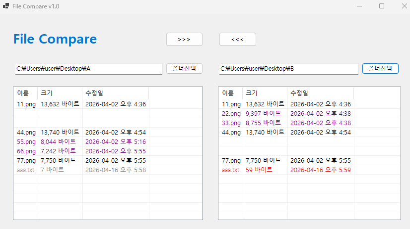
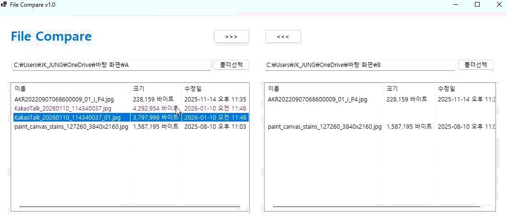
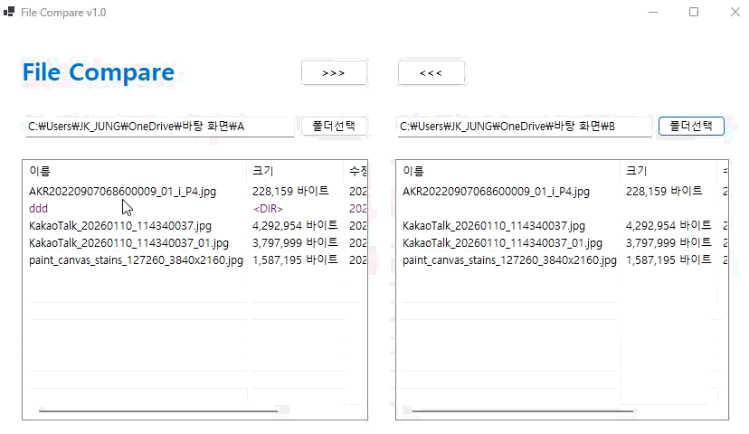

# FileCompare

## 개요
- C# 프로그래밍 학습
- 1줄 소개: 두 폴더에 담긴 파일을 비교하고 관리하는 프로그램
- 사용한 플랫폼:
    - C#, .NET Windows Forms, Visual Studio, GitHub
- 사용한 컨트롤:
    - Label, TextBox, Button, Listview, Panel

- 사용한 기술과 구현한 기능:
    - textbox를 이용하여 폴더 경로 입력 및 불러오기 기능 구현
    - populateListView() 함수를 이용하여 ListView에 파일 목록 표시
    - selectFolder() 함수를 이용하여 폴더 선택 다이얼로그 구현

## 실행 화면 (과제1)
- 코드의 실행 스크린샷과 구현 내용 설명

- 구현한 내용 (위 그림 참조)
    - Label, TextBox, Button, Listview, Panel을 사용하여 UI 구성
    - 양쪽 폴더의 파일을 선택하고 경로를 불러오는 기능 구현

    ## 실행 화면 (과제2)
- 코드의 실행 스크린샷과 구현 내용 설명

- 구현한 내용 (위 그림 참조)
    - 양쪽 폴더의 파일을 비교하여 동일한 파일과 다른 파일을 구분하는 기능 구현
    - 오래된 파일과 수정된 파일을 색으로 비교함

    ## 실행 화면 (과제3)
- 코드의 실행 스크린샷과 구현 내용 설명

- 구현한 내용 (위 그림 참조)
    - 선택한 파일 복사 기능 구현

    ## 실행 화면 (과제4)
- 코드의 실행 스크린샷과 구현 내용 설명

- 구현한 내용 (위 그림 참조)
    - 하위폴더도 하나의 파일처럼 처리
    - CopyDirectory() 함수를 이용하여 폴더 복사 기능 구현
   
